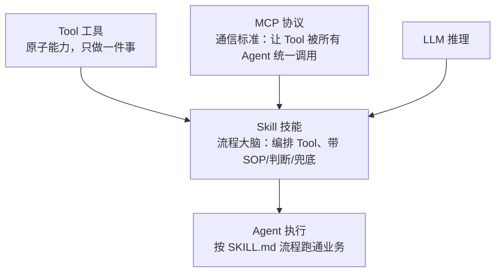

# Skill工程化总览

## 能力栈三层抽象

<b>Tool / Skill / MCP 三层抽象定位</b>

## 核心结论
- AI Agent 的能力正在从"单次工具调用"走向"**可复用、可组合的流程编排**"；Skill 把验证过的执行流程编码为结构化文档，使 Agent 从即兴推理升级为流程执行 [[raw/papers/AI-Agent-Skill工程化.md]]。
- 三层抽象口诀：**Tool 做"事"（原子能力）、Skill 做"决策"（流程编排）、MCP 做"连接"（统一调用）**。
- 工程化三要素：[[SKILL.md规范]]（渐进式披露）、[[Skill架构模式]]（P1-P7 设计模式）、[[Skill质量治理]]（六维评审 + 改进闭环）。

## 要点拆解
- **为什么需要 Skill**：单纯 LLM 即兴编排 Tool 暴露三短板——流程不可复现、质量不可控、知识不可积累；Skill 把最佳实践沉淀为流程资产。
- **质量瓶颈实证**：基于 138,000 份 SKILL.md 的大规模研究显示，路由精度、SOP 完备性、输出结构化是制约可复用性的关键 [[raw/papers/AI-Agent-Skill工程化.md]]。
- **与 MCP 互补**：Skill 定义"做什么、怎么做"，MCP 定义"如何连接、如何调用"；Skill 在 SOP 中声明依赖，通过 MCP 自动发现调用原子工具 [[raw/papers/Function-Calling与MCP-Tool设计.md]]。
- **Meta-Skill 路由**：Skill 生态 >50 个时引入高层 Skill 专门选择"该用哪个 Skill"，元数据层承担路由、body 层承担执行。

## 相关页面
- [[SKILL.md规范]]：渐进式披露架构与文件结构
- [[Skill架构模式]]：P1-P7 七层模式与十架构模式
- [[Skill质量治理]]：六维评审检查清单与治理闭环
- [[Skills技能]]：Skill 作为组织制度知识的机制（AI-native SDLC 视角）
- [[Function Calling三阶段模型]] / [[Function Tool设计规范]]：Tool 层设计
- [[MCP协议架构]]：Skill 依赖的工具通信协议
- [[Function Tool与MCP Tool对比]]：两种工具形态选型

## 参考来源
- [[raw/papers/AI-Agent-Skill工程化.md]]
- [[raw/articles/技能与工具开发问题.md]]