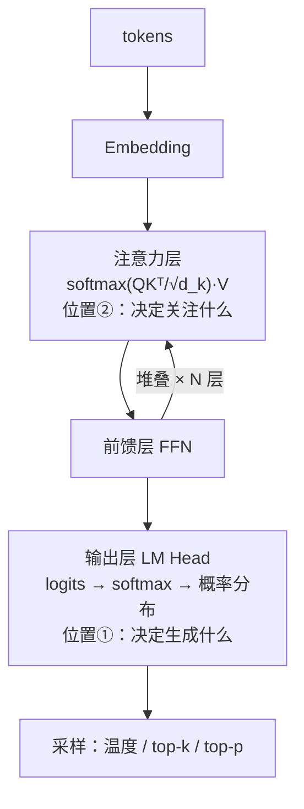

# Softmax技术全景总览

## 两个位置

## 核心结论

Softmax 是**把任意实数 logits 转化为概率分布的归一化指数函数**，是大模型中出场频率最高的数学函数。它被概率分布的三项硬约束（各项为正、总和为一、保序）加上光滑可导要求**逼成唯一自然解**——不是被挑选出来的，而是被条件逼出来的。

在 Transformer 中它**一内一外只出现两次**：**输出层**决定「生成什么」，**注意力层**决定「关注什么」。工程上靠平移不变性减 max 防溢出，online softmax 支撑 [[FlashAttention算子优化]] 把显存从 $O(n^2)$ 降到 $O(n)$；训练时与交叉熵复合，梯度简化为「预测减真实」。

## 五段主线

| 段 | 问题 | 落点页面 |
|---|---|---|
| 为什么 | 凭什么是指数，不是别的函数 | [[Softmax归一化原理]]、[[Softmax候选方案对比]] |
| 是什么 | 公式怎么算 | [[Softmax归一化原理]] |
| 在哪 | 两个位置各管什么 | [[温度参数与生成采样]]、[[注意力缩放与因果掩码]] |
| 怎么稳 | 数值不溢出、梯度不消失 | [[Softmax数值稳定性]] |
| 怎么训 | 与交叉熵如何配合 | [[交叉熵与梯度简化]] |
| 变体 | 换掉某条性质换什么 | [[Softmax变体族谱]] |

## 一个独特的数学性质

**差分变比值**：$z_i - z_j$ 直接变成概率比 $e^{z_i}/e^{z_j}$，logit 的加法对应概率的乘法，这是其他函数不具备的。由它自然导出**平移不变性** $\text{softmax}(z+c) = \text{softmax}(z)$，后者正是数值稳定性一节的全部依据。

## 相关页面

- [[自注意力机制]]：注意力层中 softmax 的作用本体。
- [[FlashAttention算子优化]]：online softmax 的工程落地，显存 $O(n^2) \to O(n)$。
- [[Softmax候选方案对比]]：softmax 相对其它归一化方案的不可替代性。
- [[Softmax·素材摘要]]：本总览所依据的 raw 素材要点摘录。

## 参考来源

- [[raw/papers/Softmax.md]]
