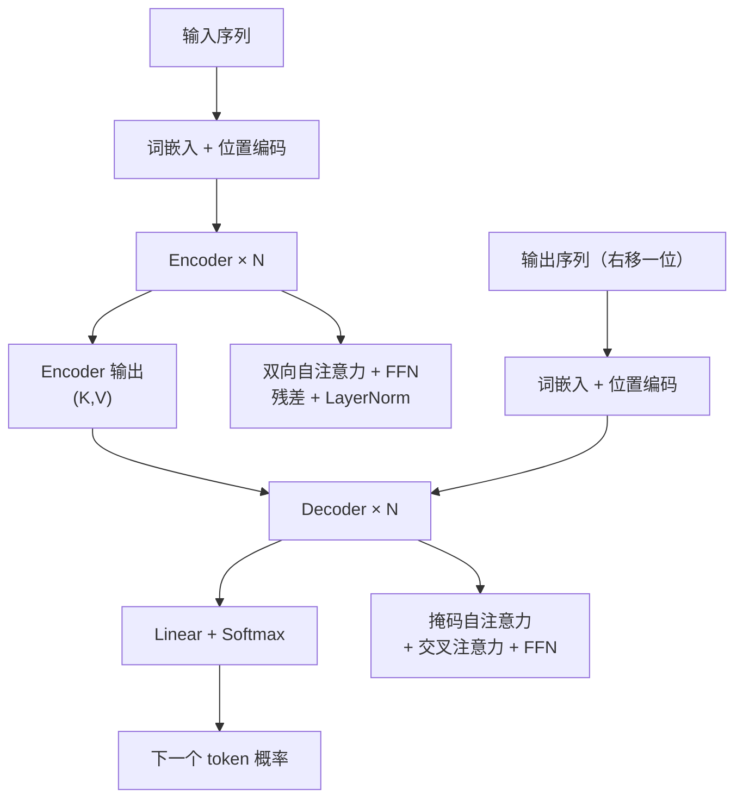

# Transformer总览

## 架构总览

<b>Transformer 整体架构</b>

## 核心结论
- Transformer 是 Vaswani 等 2017 年提出的序列到序列模型，**完全基于自注意力（Self-Attention）**，摒弃 RNN/LSTM 的时序循环结构，可并行计算整个序列 [[raw/articles/Transformer原理.md]]。
- 核心优势：$O(N^2)$ 时间复杂度但完全并行，自注意力直接建立任意两个 token 的关联；RNN 虽 $O(N)$ 但必须串行，长距离依赖易梯度消失。
- 架构变体三体系：**Decoder-only**（GPT/PaLM，去掉交叉注意力）、**Encoder-only**（BERT/RoBERTa，双向注意力）、**Encoder-Decoder**（T5/BART，完整结构）[[raw/articles/Transformer原理.md]]。

## 要点拆解
- **两大块**：Encoder 处理源语言（机器翻译语义编码），Decoder 生成目标语言；每层由子模块堆叠，全部配[[残差连接与层归一化]]。
- **核心模块**：[[位置编码]]注入顺序信息 → [[多头注意力]]建模 token 关联（Encoder 双向 / Decoder 掩码单向）→ FFN 逐 token 独立非线性变换。
- **Decoder 特有**：[[Transformer解码器结构]]含交叉注意力（Q 来自解码器、K/V 来自编码器），生成时参考源句子；GPT 类大模型裁剪掉它。
- **输出**：逐层处理 → Linear 映射词表 → Softmax → 采样得到下一个 token，循环自回归生成 [[raw/articles/Transformer原理.md]]。

## 演进与定位
- 演进路线：Transformer(2017) → BERT/GPT-2(2018-19) → GPT-3(2020) → ChatGPT/LLaMA(2022-23) → GPT-4(2023) [[raw/articles/Transformer原理.md]]。
- 在 LLM-Wiki 知识体系中的位置：是 [[Embedding向量嵌入]] 的下游（Embedding 产出 token 向量再进 Transformer），是 [[TTFT首字延迟优化]] 涉及的 prefill/KV Cache 的底层承载架构。

## 相关页面
- [[自注意力机制]]：Transformer 最核心的建模机制
- [[多头注意力]]：多个注意力头并行学习不同依赖关系
- [[位置编码]]：顺序信息注入方案
- [[Transformer编码器结构]] / [[Transformer解码器结构]]：两大子块
- [[Transformer与RNN对比]]：为何 Transformer 取代循环网络
- [[Embedding向量嵌入]]：Transformer 输入的向量化前置
- [[TTFT首字延迟优化]]：Transformer prefill 阶段的时延优化

## 参考来源
- [[raw/articles/Transformer原理.md]]