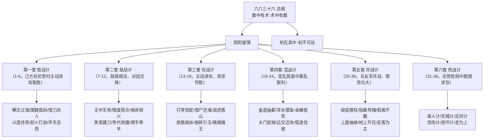

# 三十六计全库总览

## 架构图

## 核心结论

- 《三十六计》以**阴阳燮理**（事物对立统一、相反相成的规律）为哲学根基，主张谋略隐藏在事理与人情之中，符合规律才不出奇、不泄机。来源见 [[raw/books/三十六计/000-总说·三十六计.md]]。
- 全书的组织法是「六六三十六」：军事谋略分六大类、每类六小计，三十六之数取法《周易》（太玄之策三十有六）。来源见 [[raw/books/三十六计/000-总说·三十六计.md]]。
- 六套体系按**己方所处态势**由胜到败递进：[[胜战计]]（优势主动取胜）→ [[敌战计]]（势均力敌对抗）→ [[攻战计]]（主动进攻攻坚）→ [[混战计]]（混乱乘利）→ [[并战计]]（借势并战）→ [[败战计]]（劣势脱困），覆盖军事策略的全态势谱系。
- 「三十六计，走为上计」出《南齐书·王敬则传》，但全书把「走」作为最后一计定性为**有计划的主动撤退**，是保存实力、待机反攻的上策，而非消极逃跑。见 [[走为上]]。

## 要点拆解

### 哲学基础：阴阳燮理与数术

- 总说开篇即点明核心方法论：计谋基于「数」，数与术相互蕴含（数中有术、术中有数），即策略必须建基于对客观形势的计算与把握，而非孤立玩弄权术。
- 兵家计谋能否成功，取决于能否正确把握对立统一、相反相成的**阴阳变化规律**（如明与暗、虚与实、利与害、进与退）。
- 「机不可设，设则不中」——应付事变的谋略不能脱离实际形势生硬预设，必须因机而变。
- 来源：[[raw/books/三十六计/000-总说·三十六计.md]]「总说解析」。

### 六套体系的态势逻辑

| 套系 | 计序 | 适用态势 | 策略主轴 | 主题页 |
|------|------|----------|----------|--------|
| [[胜战计]] | 1-6 | 己方占优、宜主动出击 | 示形诱敌、以弱示强变主动为胜势 | [[胜战计]] |
| [[敌战计]] | 7-12 | 敌我相当、临阵交锋 | 虚实互变、化被动为主动 | [[敌战计]] |
| [[攻战计]] | 13-18 | 主动进攻、攻坚破敌 | 疑叩实、擒王、调动敌人脱离优势 | [[攻战计]] |
| [[混战计]] | 19-24 | 局势混乱、各方并起 | 乘乱取利、抽薪、浑水摸鱼 | [[混战计]] |
| [[并战计]] | 25-30 | 与友军并战、借势扩张 | 借局布势、反客为主、兼并壮大 | [[并战计]] |
| [[败战计]] | 31-36 | 己方劣势、败局求存 | 攻心、疑阵、自伤、退走保实力 | [[败战计]] |

### 使用原则与避坑

- 计谋须契合「事理」与「人情」，违反常规行事（事出不经）会立刻让对方生疑，机谋随之泄露。
- 善于「杂于利害」：如[[走为上]]中曹操能断然舍弃「鸡肋」、范蠡功成急流勇退，都是权衡利害、保全实力的范例。
- 部分计策风险极高（如[[败战计]]中的空城计、苦肉计），须清楚掌握对手将帅心理与性格方可使用。

## 相关页面

- [[走为上]]：全书最后一计，也是广为流传的三十六计代表，阐述「以退为进、保存实力」的策略哲学。
- [[阴阳燮理]]：三十六计的哲学根基，对立统一规律如何落到谋略层面。
- [[胜战计]]：第一套体系的六计详解与使用场景。
- [[敌战计]] / [[攻战计]] / [[混战计]] / [[并战计]] / [[败战计]]：其余五套体系。

## 参考来源

- [[raw/books/三十六计/000-总说·三十六计.md]]：总说·原文、按语、注释、译文、总说解析（本次总览的直接出处）。
- [[raw/books/三十六计/001-瞒天过海.md]] ～ [[raw/books/三十六计/036-走为上.md]]：每计原文、计名解析、实例解读（六套体系划分依据）。