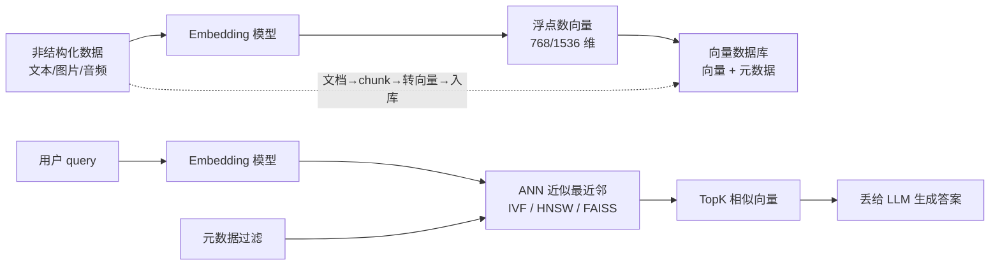

---
type: overview
source: [[raw/articles/向量Embedding与向量数据库介绍.md]]
description: "Embedding 与向量数据库全景：把非结构化内容翻译成向量空间坐标、以 ANN 近似检索替代暴力扫描，覆盖 Embedding 定义、向量库 vs 传统库、IVF/HNSW/PQ 三大加速机制与检索权衡。"
created_at: 2026-09-16 08:30:12
updated_at: 2026-09-16 08:30:12
tags: [embedding, vector_database, ann, hnsw, ivf, pq, rag]
---

# 向量Embedding与向量数据库总览

## 链路总览

## 核心结论

- **Embedding 一句话**：把内容翻译成向量空间里的坐标，语义相近的内容在空间里距离更近；检索算向量相似度（余弦/欧氏），而非关键词匹配。→ [[Embedding向量嵌入]]
- **向量库 vs 传统库**：传统库擅长精确匹配（B树/哈希/等值范围），向量库擅长近似相似度检索（ANN/TopK）；pgvector 等插件只能小规模，亿级向量性能弱于专业向量库。→ [[向量数据库]] [[向量数据库与传统数据库对比]]
- **向量搜索为什么快**：不是扫全量，而是用 ANN 索引"剪枝"——只在小部分候选里找最近邻，牺牲一点召回率换取毫秒级查询。→ [[ANN近似最近邻搜索]]
- **三大加速机制**：IVF 先聚类再局部搜索、HNSW 多层跳表+图结构导航、PQ 乘积量化压缩向量省内存；配合内存优先与 SIMD 硬件加速。→ [[IVF倒排索引]] [[HNSW图索引]] [[PQ乘积量化]]
- **速度 ↔ 召回率是 trade-off**：调大候选数召回更高但变慢，调小更快但可能漏检；量化压缩也牺牲精度。

## 相关页面
- [[Embedding向量嵌入]]：向量空间坐标的基本概念
- [[向量数据库]]：向量+元数据存储检索
- [[向量数据库与传统数据库对比]]：两类库横向对比
- [[ANN近似最近邻搜索]]：剪枝加速的底层思想
- [[IVF倒排索引]] [[HNSW图索引]] [[PQ乘积量化]]：三大索引/压缩机制
- [[RAG检索优化五层]]：HNSW 粗召回 + Int8 量化在线上五层组合拳中的实战位置
- [[Hybrid混合检索]]：Dense 语义路 + Sparse 关键词路融合

## 参考来源
- [[raw/articles/向量Embedding与向量数据库介绍.md]]