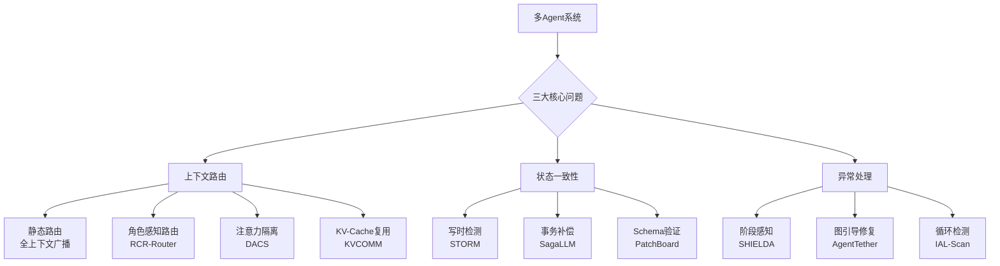
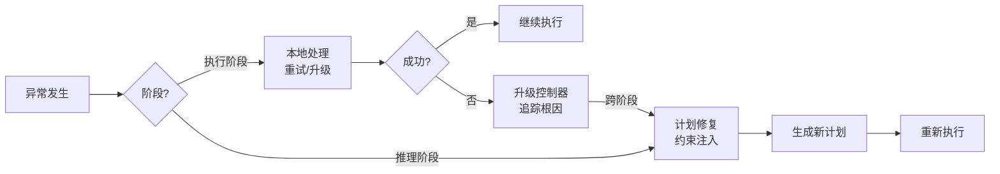

# 多Agent上下文管理总览

## 核心结论

多Agent系统的上下文管理面临三大核心挑战：**上下文路由**（给每个Agent合适的信息）、**状态一致性**（并发操作不冲突）、**异常处理**（失败/循环时可控恢复）。工业界和学术界已形成从简单全上下文广播到精细路由、从事后合并到写时检测、从盲目重试到结构化恢复的演进路径。

## 流程总览

## 一、上下文路由：给每个Agent什么信息？

### 1.1 核心挑战

- **上下文污染**：N个Agent竞争编排器上下文窗口，任务状态相互干扰
- **上下文爆炸**：根Agent完整历史传递给子Agent，token指数增长
- **上下文碎片化**：信息分散在多个Agent，无单一完整视图

### 1.2 方案演进

| 阶段 | 方案 | 策略 | 局限 |
|------|------|------|------|
| 第一代 | 静态路由 | 固定模板分配 | 无适应性 |
| 第一代 | 全上下文路由 | 完整历史广播 | token浪费 |
| 第二代 | RCR-Router | 角色+阶段感知路由 | 需要角色定义 |
| 第二代 | DACS | 非对称上下文隔离 | 需要触发机制 |
| 第三代 | Agent-Radar | 注意力权重引导 | 需要拓扑信息 |

### 1.3 关键架构：Google ADK四层模型

| 层级 | 说明 | 生命周期 |
|------|------|----------|
| Working Context | 当前调用的即时prompt | 临时 |
| Session | 持久交互日志 | 持久 |
| Memory | 跨Session长期知识 | 持久 |
| Artifacts | 大文件按名寻址 | 持久 |

核心原则：**存储与呈现分离**，Working Context是从Session编译的临时视图。

## 二、状态一致性：并发怎么不冲突？

### 2.1 核心挑战

- Agent并发读写共享状态，修改可能静默冲突
- Agent推理期间（秒到分钟级），读集既未锁定也未验证
- 已提交的外部效应（邮件/支付）无法撤销

### 2.2 方案对比

| 方案 | 检测时机 | 一致性保证 | 适用场景 |
|------|----------|-----------|----------|
| STORM | 写时 | 局部状态一致性 | 并发代码编辑 |
| SagaLLM | 操作后 | 最终一致性+补偿 | 多步规划 |
| PatchBoard | 提交前 | 强Schema一致性 | 结构化状态 |
| S-Bus | 提交时 | 可观测读隔离 | HTTP共享状态 |

### 2.3 关键洞察

**STORM的核心发现**：Agent不需要全局快照，只需保证其读取的文件在推理期间未被修改（局部状态一致性）。写时检测比事后合并更有效——将隐藏的集成错误转化为显式的写时反馈。

## 三、异常处理：失败/循环怎么办？

### 3.1 核心挑战

- **阶段感知**：执行阶段的异常可能根因在推理阶段
- **无限循环**：反馈路径无有效终止条件，69.1%源于无界重试
- **静默失败**：返回错误但看似合理的输出

### 3.2 方案矩阵

| 场景 | 方案 | 机制 |
|------|------|------|
| 异常分类 | SHIELDA | 36类异常+阶段感知升级 |
| 运行时修复 | AgentTether | CTG图诊断+行为范围干预 |
| 循环检测 | IAL-Scan | 静态分析+ALDG依赖图 |
| 生产自愈 | 自愈编排器 | 信号→分类→恢复→验证 |
| 低成本监控 | Real-Time Detection | 回声状态网络+回滚 |

### 3.3 关键架构：SHIELDA阶段感知

## 四、方案选择指南

| 你的场景 | 推荐方案 | 理由 |
|----------|----------|------|
| 多角色协作推理 | RCR-Router | 角色感知+token预算控制 |
| 并发Agent编排 | DACS | 非对称隔离，Focus模式按需加载 |
| 并发代码编辑 | STORM | 写时冲突检测，局部一致性 |
| 多步规划/预订 | SagaLLM | 事务补偿，可回滚 |
| 长期任务 | ACM | Agent自主管理，无损压缩 |
| 生产环境监控 | 自愈编排器 | 有界恢复+验证 |
| 开发阶段预防 | IAL-Scan | 静态分析循环风险 |

## 相关页面

- [[上下文污染]]：上下文污染的定义、分类与解决方案
- [[Agent状态一致性]]：多Agent并发状态管理的四种方案
- [[Agent异常处理与循环检测]]：失败检测、修复与循环预防的五种方案
- [[多Agent上下文管理·素材摘要]]：原始素材要点摘录

## 参考来源

- [[raw/articles/multi-agent-context-management.md]]
