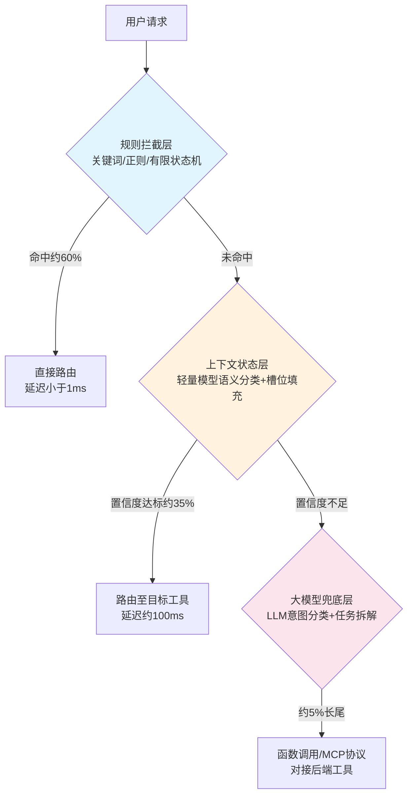

# Agent意图识别

## 架构总览

## 核心结论
- 意图识别是工业级 Agent 路由的总闸门，误判将导致全链路工具调用偏差。
- 全量大模型方案存在延迟、成本、稳定性三重硬伤。
- 分层漏斗按请求复杂度递进分配算力，使准确率、低延迟与低成本三者同时成立。

## 要点拆解

### 三层漏斗
| 层级 | 流量占比 | 延迟 | 技术手段 |
|------|----------|------|----------|
| 规则拦截层 | 约 60% | <1ms | 关键词、正则、有限状态机 |
| 上下文状态层 | 约 35% | ~100ms | 轻量小模型语义分类+槽位填充 |
| 大模型兜底层 | 约 5% | 500-2000ms | LLM 意图分类+任务拆解 |

### 层间协同
- 规则层未命中时，将原始请求与规则匹配中间结果传递至上下文层。
- 规则层与上下文层同时命中但意图不一致时，以规则层结果为准（确定性优先）。
- 上下文层服务不可用时，规则层命中直接路由，未命中请求全部降级至大模型层。

### 工业实践
- 置信度阈值：0.7（成本最低）/ 0.8（平衡点）/ 0.9（准确率最高）。
- 规则治理：上限 200 条，每周审计命中率，清理零命中规则。
- 监控指标：规则层命中率 ≥55%、上下文层命中率 ≥30%、LLM 兜底率 ≤8%。

## 相关页面
- [[分层漏斗路由]]：核心架构概念
- [[规则拦截层]]：第一层技术细节
- [[上下文状态层]]：第二层技术细节
- [[大模型兜底层]]：第三层技术细节
- [[置信度阈值]]：层间流转机制
- [[意图评测]]：评测方法论
- [[全量大模型vs分层漏斗]]：方案对比
- [[FrugalGPT]]：成本优化理论来源
- [[RouteLLM]]：路由优化理论来源

## 参考来源
- [[raw/papers/工业级Agent意图识别分层漏斗.md]]
