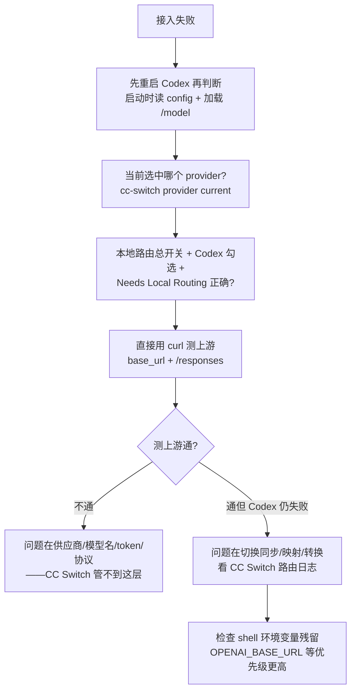

# Codex接第三方模型排障清单

## 排查总纲

**两条铁纪律**：
1. **切换后先重启 Codex**，再谈排查——它启动时才读 `config.toml`、`/model` 才加载模型目录；
2. **先手动跑通再上工具**——手动 curl 通过，才能把问题定位到 CC Switch 这层，而不是把未知问题层层叠着。

## 问题速查表

| # | 现象 | 首要检查 | 常见根因 |
|---|---|---|---|
| 1 | 切了 CC Switch，Codex 还是旧模型 | 本地路由三开关 + 重启 Codex + `/debug-config` | 未重启；Mapping 变更未刷新；路由没接管 |
| 2 | 404 / 400 / 找不到 /responses | curl 测 `<base_url>/responses` | 把 Chat 当 Responses；/v1 多/少一层；重复拼 /chat/completions；路由没接管 |
| 3 | 401 / 403 | 检查 env_key 对应环境变量 / CC Switch 保存的 Key | Key 无效/区域错/余额不足；Header 格式（Bearer vs x-api-key）错；代理删认证 |
| 4 | 第三方模型不上 /model | 模型映射是否含真实 Model ID + 重启 Codex | Mapping 缺失；model_catalog_json 无效；模型被供应商下线/改名 |
| 5 | 能聊天，不能读写文件/跑命令 | 用真实任务测"读→改→测→修"闭环 | 模型工具调用弱；上游不支持 function calling；tool call ID 丢失；上下文短；目录误声明 |
| 6 | 流式频繁中断 | 看 CC Switch 路由日志 + 上游响应 | 上游推理久；SSE 未及时发/被缓冲；非标准事件；兼容性问题 |
| 7 | `wire_api = "chat"` 启动失败 | `codex --strict-config` | 过时教程写法，当前只支持 responses，改用 CC Switch |
| 8 | 官方登录/官方功能异常 | 先切 OpenAI Official + Keep official login + `codex login status` | 顺序倒置；auth.json 被覆盖；未重启 |
| 9 | Web Search / 图片等高级功能不可用 | 逐项验证，勿默认开启声明 | 上游不兼容；`supports_standalone_web_search` 误开 |

## 分症状详解

### 症状 1：切了没反应
按序：目标 provider 是否当前启用 → 本地路由总开关 → Routing Enabled 里勾了 Codex → Needs Local Routing 正确 → CC Switch 还在跑 → 完全重启 → `/debug-config` 看配置来源。

### 症状 2：404 / 400
Base URL 别重复拼路径（CC Switch 会自动拼 `/responses` 或 `/chat/completions`）；非标准地址开 **Full URL Mode**；第三方网关是否实现完整 Responses。判断口诀：不要因"兼容 OpenAI API"宣传就默认 Responses，多数只兼容 Chat Completions。

### 症状 3：401 / 403
环境变量名要与 `env_key` **完全一致**；GUI 应用不继承终端临时变量（见症状 8 的 IDE 分支）。查变量别打全量 Key：`printenv THIRD_PARTY_API_KEY`。

### 症状 4：模型不上菜单
映射的 Model ID 必须与供应商文档逐字一致；`/model` 启动才加载 → 改完必重启；手动配置提供 `model_catalog_json`。

### 症状 5：只聊天不能干活
这不是 CC Switch 的锅就是上游能力的锅：模型工具调用差 / 上游无 function calling / 中转丢 tool call ID / SSE 分片重组错误 / JSON Schema 被改 / 上下文过短 / 目录能力误声明。**别只发"你好"验收**，跑完整"读→改→测→修"闭环。

### 症状 6：流式中断
先看是上游还没发、还是发了被缓冲（CDN/反代/公司网络）；再给超时与重试兜底（`stream_idle_timeout_ms=600000`、`stream_max_retries=5`）。**超时只能缓解网络和长推理，修不了错误的协议实现**。

### 症状 7：旧配置写法
`wire_api="chat"` / 旧的 `[profiles.<name>]` 表已废弃——前者直接用 `codex --strict-config` 暴露，后者迁移为 `<name>.config.toml` 独立文件（[[Codex配置档案Profile]]）。

### 症状 8：官方登录与 IDE 分支
- IDE 缺 Key：从已设变量的终端启动 IDE / 持久化到系统用户环境 / 完全退出重开 / 改用 CC Switch；
- 登录丢：按 [[Codex官方登录保留机制]] 的顺序重新走一遍；
- **禁止分享/编辑含 Access Token 的 auth.json**。

### 症状 9：高级功能
自定义 provider 默认不声明 standalone Web Search，只有上游真实兼容才开；图片输入、WebSocket、响应存储逐项验证，不默认可用。

## 切换没生效的通用顺序（无 CC Switch 时同样适用）

1. 重启目标 CLI / 重开终端；
2. `cc-switch provider current`（或管理工具当前状态）确认选中的 provider；
3. `cc-switch env check` 查环境变量覆盖；
4. 绕过工具，手动用 Base URL + Key 跑一次最小请求；
5. 手动也不通则 = 供应商/model/token/协议问题。

## 相关页面

- [[Codex接入第三方模型总览]]：被排障对象的全景
- [[CC Switch本地路由]] / [[Codex模型映射与模型目录]]：症状 1/2/4/6 的机制面
- [[Codex官方登录保留机制]]：症状 8
- [[Codex自定义模型Provider]]：症状 7
- [[重试预算与幂等保护]]：症状 3/6 的网关侧通用经验
- [[SSE流式容错]]：症状 6 的流式经验

## 参考来源

- [[raw/articles/cc-switch-codex-第三方模型接入.md]]
- [[raw/articles/cc-switch安装与使用教程.md]]