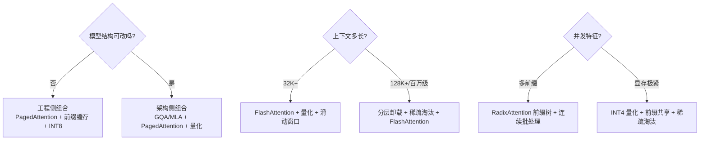

# KVCache场景选型指南

## 选型决策流程

## 场景化选型决策表

| 约束条件 | 场景描述 | 推荐技术组合 | 预期收益 |
|---|---|---|---|
| 不可修改模型结构 | 第三方开源模型、业务侧无权训练 | PagedAttention + 前缀缓存 + INT8 量化 | 显存↓2–3×，吞吐↑2–4× |
| 可调整模型架构 | 自研模型、可二次训练 | GQA（8 组主流）+ PagedAttention + 量化 | 显存↓8–16×，吞吐↑3–5× |
| 长上下文推理 | 32K 以上上下文、文档问答 | FlashAttention + 量化 + 滑动窗口 | 支持长度↑4–8× |
| 显存极度紧张 | 单卡小显存、高并发部署 | INT4 量化 + 前缀共享 + 稀疏淘汰 | 显存↓4–6× |
| 超长长上下文 | 128K 以上、百万级上下文 | 分层卸载 + 稀疏淘汰 + FlashAttention | 有效容量↑10–50× |
| 多前缀高并发 | 系统提示词统一、多租户服务 | RadixAttention 前缀树 + 连续批处理 | 吞吐↑2–3× |

## 技术叠加优先级

各类优化技术**相互正交、可叠加**，落地顺序按「成本从低到高、收益从大到小」排列：

1. **基础工程优化**：[[PagedAttention分页内存]] + 连续批处理——零精度损失，部署侧即可开启；
2. **数据层优化**：[[KVCache低比特量化]] INT8 → INT4——几乎无损，无需改模型；
3. **计算层优化**：[[FlashAttention算子优化]]——长上下文必开，无损；
4. **复用优化**：[[前缀缓存与PagedAttention]]——多轮 / 多租户场景收益显著；
5. **架构层优化**：[[GQA与MQA多头变体]] / [[MLA低秩潜在注意力]]——需训练，但收益最大；
6. **极端场景优化**：[[KV Cache分级存储]]、稀疏淘汰——仅超长长上下文启用。

叠加后显存压缩效果**相乘**，例如 GQA-8 + INT4 可把 KV 压到原 MHA FP16 的 **1/16**。

## 核心结论

选型的第一分水岭是**模型结构能不能改**：不能改就只能在工程、数据、计算、复用四层里组合；能改则架构层直接把基数砍下来，量级差别在 4–16 倍。第二分水岭是**上下文长度**：32K 以上 FlashAttention 必开，128K 以上才引入分层卸载与稀疏淘汰这类有损手段。

## 相关页面

- [[KV Cache优化技术栈总览]]：选型所依据的五级栈
- [[主流推理框架KV技术对比]]：选定技术后落到哪个框架
- [[Prefill与Decode两阶段]]：PD 分离等调度手段的适用前提
- [[显存墙]]：不优化就会撞上的容量红线

## 参考来源

- [[raw/papers/KV Cache.md]]
