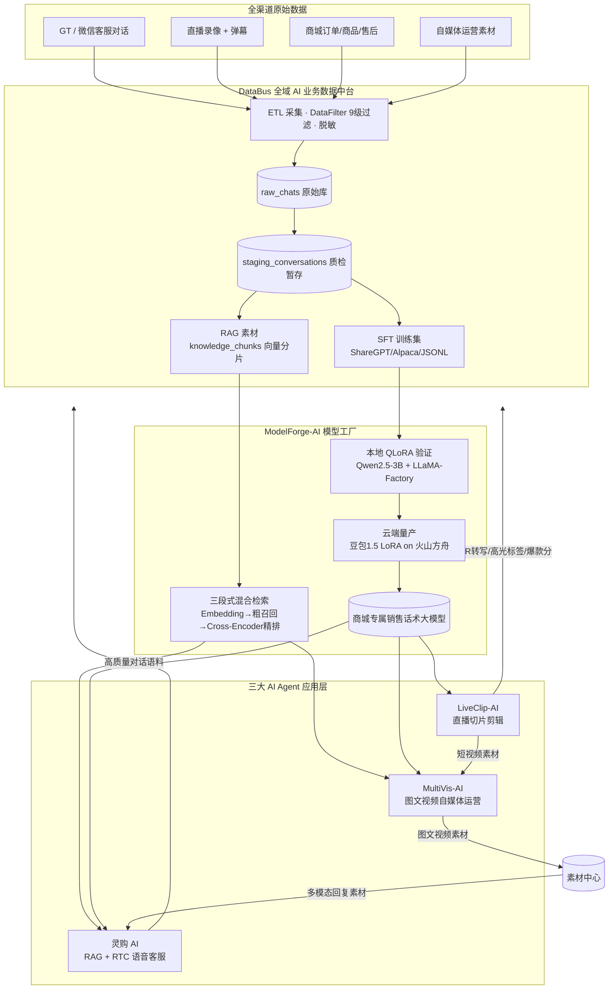

# 商城AI业务矩阵

## 架构总览



## 核心结论
- 五项目遵循「**先聚数据 → 再训模型 → 再落地 Agent**」体系，各管一环，整体形成 **数据—模型—应用—反哺** 闭环。
- 骂你核心分工：**DataBus 洗数据，ModelForge 训模型，灵购/LiveClip/MultiVis 三个 Agent 落场景，产出回流 DataBus 持续迭代**。
- 用户主负责 [[灵购AI]] 的 RTC 语音链路、[[RAG检索优化五层|RAG 接入]]与推理优化；其余项目架构上深悉、流水线与专项同学共建。

## 要点拆解

### 五项目一句话定位

| 项目 | 定位 | 理顺关系 |
|------|------|----------|
| [[DataBus]] | 全域 AI 业务数据中台 | 供灵购知识库；收各 Agent 回流 |
| [[ModelForge-AI]] | 电商自有化模型微调工厂 | 供灵购 LLM + Rerank 能力 |
| [[灵购AI]] | 商品知识库 + RTC 语音客服 | 消费 DataBus 知识 + ModelForge 模型 |
| [[LiveClip-AI]] | 直播切片智能剪辑 Agent | ASR/高光标签回流 DataBus，短视频供 MultiVis |
| [[MultiVis-AI]] | 图文视频自媒体运营 Agent | 素材入素材中心 → 供灵购多模态回复 |

### 数据流转闭环
```
微信/GT客服对话 ┐
商城商品/售后文档 ┼→ DataBus → SFT集 / RAG素材
直播ASR/话术回流 ┤         ↓
线上优质对话回流 ┘   ModelForge 微调模型
                               ↓
        灵购AI ← RAG知识库 → LiveClip / MultiVis
                   ↓ 回流
                DataBus
```

## 相关页面
- [[灵购AI]]：用户主负责的项目，RTC + RAG + 推理优化全链路
- [[DataBus]]、[[ModelForge-AI]]：体系的数据与模型底座
- [[LiveClip-AI]]、[[MultiVis-AI]]：内容生产侧 Agent，参与闭环
- [[四大项目架构对比]]：DataBus/ModelForge/LiveClip/MultiVis 横向对比
- [[RAG检索优化五层]]、[[TTFT首字延迟优化]]、[[FEC与自适应JitterBuffer]]：灵购 AI 三条核心优化主线

## 参考来源
- [[贸易AI业务]]