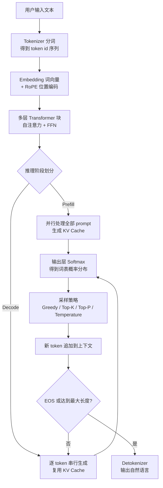

# 大模型推理全链路

## 核心结论

大模型推理是一条 **"文本→token→向量→多层 Transformer→概率采样→自回归循环"** 的流水线。每个 token 的生成都经历完整的六个环节，直到命中 EOS 或达到最大长度。

## 流程总览

## 要点拆解

### 1. Tokenizer 分词编码

将连续自然语言切分为模型词表中的最小离散单元——token。现代大模型普遍采用 **BPE** 或其变体（Unigram、WordPiece），切分粒度介于"词"与"字符"之间。模型从未见过"文字"本身，只处理 ID 序列。详见 [[Tokenizer分词编码]]。

### 2. Embedding 与位置编码

Embedding 层是可学习的查找矩阵 `[vocab_size, hidden_dim]`，将 token ID 映射为高维向量。位置编码从绝对位置演进到 **RoPE**（旋转位置编码），使注意力得分仅依赖 token 间的相对位置差。详见 [[Embedding与位置编码]]。

### 3. 多层 Transformer

每层包含两个子模块，采用 **Pre-Norm 残差包裹**：`x = x + Attn(LN(x))`，再 `x = x + FFN(LN(x))`。自注意力实现"按相关性融合全上下文"，FFN 以 **SwiGLU** 门控激活承担知识存储。详见 [[自注意力机制]]、[[SwiGLU门控激活]]。

### 4. Prefill 与 Decode 两阶段

| 维度 | Prefill | Decode |
|---|---|---|
| 计算模式 | 整段 prompt **并行**过网络 | 每步仅计算**一个**新 token |
| 瓶颈 | 计算密集（compute-bound） | 访存密集（memory-bound） |
| 决定指标 | 首 token 延迟 TTFT | 生成速度 tokens/s（TPOT） |

**KV Cache** 是 Decode 阶段的加速核心：将已计算好的 K、V 存入显存，避免每步重算。详见 [[Prefill与Decode两阶段]]、[[KV Cache]]、[[KV Cache显存估算]]。

### 5. 输出层与采样策略

最后一层隐向量乘以 lm_head 矩阵得到 logits，经 softmax 变换为词表概率分布。采样策略在确定性与多样性间权衡：Greedy（确定性）、Temperature（连续调节）、Top-K（固定候选数）、Top-P（动态候选集）。详见 [[采样解码策略]]。

### 6. 自回归迭代与终止

生成的 token id 追加到上下文末尾，作为下一轮 Decode 输入，同时对应 K/V 并入 KV Cache。循环终止条件：命中 EOS、达到 `max_new_tokens`、命中自定义停止字符串。详见 [[自回归迭代与终止]]。

## 相关页面

- [[Tokenizer分词编码]]：文本到 token 的转换机制
- [[Embedding与位置编码]]：词向量与 RoPE 位置编码
- [[SwiGLU门控激活]]：现代 FFN 的门控激活函数
- [[采样解码策略]]：Greedy/Temperature/Top-K/Top-P 对比
- [[自回归迭代与终止]]：循环终止条件与 tokens/s 衡量
- [[KV Cache显存估算]]：KV Cache 显存占用公式与实例
- [[Prefill与Decode两阶段]]：两阶段计算模式与瓶颈
- [[KV Cache]]：Decode 阶段加速核心机制

## 参考来源

- [[raw/papers/大模型推理全链路.md]]
